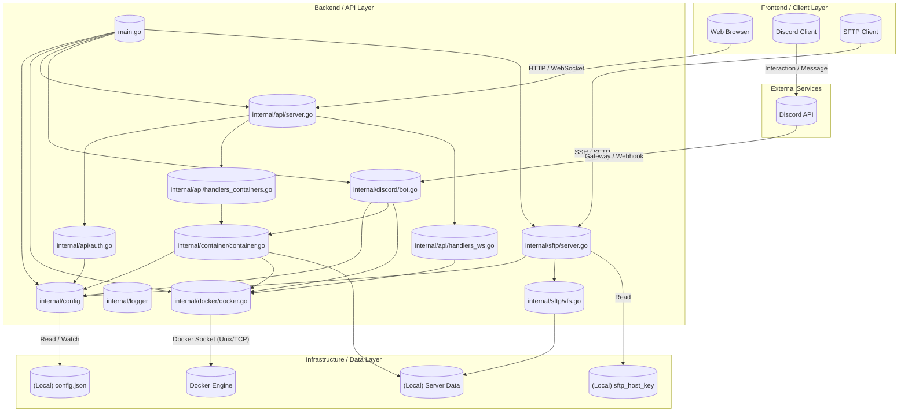

# システム設計書: Play-Bin

## A. 技術スタック (Tech Stack)

### Languages & Frameworks

- **Go (1.25.5)**: バックエンドの主要言語
- **Discordgo**: Discord Bot API クライアント
- **Docker SDK for Go**: Docker エンジン操作
- **Gorilla WebSocket**: リアルタイム通信 (ターミナル/ステータス)
- **pkg/sftp & crypto/ssh**: SFTP/SSH サーバー実装

### Infrastructure & Runtime

- **Docker Engine**: コンテナランタイム
- **Local Storage**: JSON設定ファイル (`config.json`) / SFTP ホストキー
- **Rsync**: バックアップ/リストア処理用 (CLI 実行)

### Development Tools

- **VSCode**: 推奨開発環境
- **Gemini / Antigravity**: AI 支援

## B. システム概要 (High-Level Overview)

Play-Bin は、Docker コンテナとして実行されるゲームサーバー群を統合管理するためのミドルウェアです。
ユーザーは Web UI (HTTP/WebSocket) や Discord Bot、SFTP クライアントを通じて、コンテナの操作（起動・停止）、ファイル管理、コマンド送信、バックアップ・リストアを行うことができます。
設定は単一の `config.json` で管理され、ホットリロードに対応しているため、動的なサーバー構成変更が可能です。
各インターフェース（API, Discord, SFTP）は権限管理システムにより保護されており、ユーザーごとにアクセス可能なサーバーや操作を制限します。

## C. アーキテクチャ図 (Architecture Diagram)

## D. コンポーネント詳細

### Frontend / Client Layer

- **Web Browser**: シングルページアプリケーション (SPA) などを通じてシステムのGUIを利用。
- **Discord Client**: チャットコマンドやGUIボタンでサーバーを操作。
- **SFTP Client**: ファイル転送ソフト (WinSCP, FileZilla等) でサーバーファイルを直接編集。

### Backend / API Layer

- **main.go**: アプリケーションのエントリーポイント。各サービスの初期化と起動順序を制御。
- **internal/api**:
  - **Server**: HTTPサーバーとルーティング定義。
  - **Auth**: トークンベースの認証と権限チェックを行うミドルウェア。
  - **Container Handlers**: コンテナ一覧、操作、ログ取得などのREST API実装。
  - **WS Handlers**: xterm.js 用のターミナル通信やリアルタイムステータス配信。
- **internal/discord**:
  - **Bot Manager**: 複数トークンに対応したBotセッション管理。
  - **Interactions**: スラッシュコマンド (`/action`, `/cmd`) の処理と権限確認。
- **internal/sftp**:
  - **Server**: SSHプロトコルを用いたSFTPサーバー。
  - **VFS Handler**: 仮想ファイルシステム。Dockerマウントポイントをユーザーごとのルートディレクトリにマッピング。
- **internal/container**:
  - **Manager**: コンテナのライフサイクル管理 (Start, Stop, Kill) および rsync を用いたバックアップ/リストア機能。
- **internal/config**:
  - JSON設定ファイルの読み込み、構造化、およびホットリロード機能の提供。
- **internal/docker**:
  - Docker SDK のラッパー。初期化や共通エラー処理を担当。

### Infrastructure / Data Layer

- **(Local) config.json**: ユーザー、サーバー、権限、コマンド定義を含む設定ファイル。
- **(Local) sftp_host_key**: SSHサーバーのホスト認証用秘密鍵。
- **Docker Engine**: 実際のコンテナ実行を担うデーモン。
- **(Local) Server Data**: コンテナにバインドマウントされるホスト上の実データディレクトリ。

### External Services

- **Discord API**: Bot の接続、メッセージ送受信、インタラクションイベントの提供。

## E. データ構成

```mermaid
graph TD
    Root[("play-bin/")]

    %% Configuration & Local Data
    Config["config.json"]
    ConfigEx["config.example.json"]
    LogFile["logs.json"]
    HostKey["sftp_host_key"]
    HostKeyPub["sftp_host_key.pub"]
    License["LICENSE"]
    Readme["README.md"]
    GoMod["go.mod"]
    GoSum["go.sum"]

    Root --> Config
    Root --> ConfigEx
    Root --> LogFile
    Root --> HostKey
    Root --> HostKeyPub
    Root --> License
    Root --> Readme
    Root --> GoMod
    Root --> GoSum

    %% Frontend Assets
    IndexHTML["index.html"]
    Root --> IndexHTML

    %% Source Code
    MainGo["main.go"]
    Root --> MainGo

    %% Internal Packages
    Internal["internal/"]
    Root --> Internal

    API["api/"]
    Internal --> API
    APIAuth["auth.go"]
    APIContainers["handlers_containers.go"]
    APIWS["handlers_ws.go"]
    APIMiddleware["middleware.go"]
    APIServer["server.go"]
    API --> APIAuth
    API --> APIContainers
    API --> APIWS
    API --> APIMiddleware
    API --> APIServer

    ConfigPkg["config/"]
    Internal --> ConfigPkg
    ConfigGo["config.go"]
    ConfigPkg --> ConfigGo

    Container["container/"]
    Internal --> Container
    ContainerGo["container.go"]
    Container --> ContainerGo

    Discord["discord/"]
    Internal --> Discord
    DiscordBot["bot.go"]
    DiscordFwd["forwarder.go"]
    DiscordSvc["service.go"]
    Discord --> DiscordBot
    Discord --> DiscordFwd
    Discord --> DiscordSvc

    DockerPkg["docker/"]
    Internal --> DockerPkg
    DockerGo["docker.go"]
    DockerPkg --> DockerGo

    Logger["logger/"]
    Internal --> Logger
    LoggerGo["logger.go"]
    Logger --> LoggerGo

    SFTP["sftp/"]
    Internal --> SFTP
    SFTPServer["server.go"]
    SFTP --> SFTPServer

    %% Other Directories
    DockerDir["docker/"]
    Root --> DockerDir
    Dockerfile["template.dockerfile"]
    DockerDir --> Dockerfile
```

