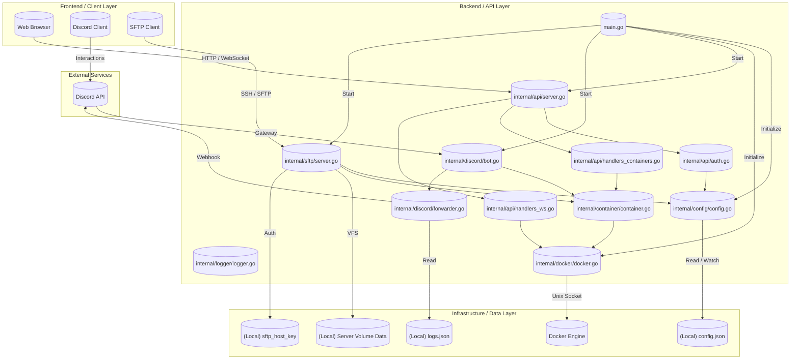

# システム設計書: Play-Bin

## A. 技術スタック (Tech Stack)

使用する技術を以下のカテゴリーに分類しています。

- **Languages & Frameworks**:
  - `Go (1.25.5)`
  - `Discordgo (v0.29.0)`: Discord Bot API クライアント
  - `Docker SDK for Go (v28.5.2+incompatible)`: Docker エンジン操作
  - `Gorilla WebSocket (v1.5.4-0.20250319132907-e064f32e3674)`: リアルタイム通信
  - `pkg/sftp (v1.13.10)`: SFTP サーバー実装
- **Infrastructure & Runtime**:
  - `Docker Engine`: コンテナランタイム
  - `Local Storage`: JSON設定ファイル (`config.json`) / SFTP ホストキー
  - `Rsync`: バックアップ/リストア処理用 (CLI 実行)
- **Development Tools**:
  - `VSCode`
  - `Gemini / Antigravity`

## B. システム概要 (High-Level Overview)

Play-Bin は、Docker コンテナとして実行されるゲームサーバー群を統合管理するためのミドルウェアです。

ユーザーは Web UI (HTTP/WebSocket) や Discord Bot、SFTP クライアントを通じて、コンテナの操作（起動・停止・削除）、ファイル管理、コンソール送信、バックアップ・リストアを行うことができます。

システムは権限管理モジュールを備えており、ユーザーごとに「どのサーバーに対して」「どの操作（閲覧、操作、ファイル編集等）」を許可するかを細かく制御します。

設定は `config.json` に集約されており、動的なリロードによって稼働中のシステムに即座に反映されます。

## C. アーキテクチャ図 (Architecture Diagram)



## D. コンポーネント詳細

### Frontend / Client Layer

- **Web Browser**: 管理用 Web UI (index.html)。WebSocket によるリアルタイムログ表示や操作。
- **Discord Client**: `/action` 等のスラッシュコマンド経由の操作、コンテナログの異常検知通知の受信。
- **SFTP Client**: WinSCP 等を用いたコンテナ内ファイルの直接管理。

### Backend / API Layer

- **main.go**: アプリケーションの起動と各モジュールのライフサイクル管理。
- **internal/api/server.go**: HTTP/WebSocket API エンジン。ルーティングとサーバー起動。
- **internal/api/auth.go**: トークンベース認証および階層型権限チェック。
- **internal/api/handlers_containers.go**: コンテナの起動・停止・ステータス取得等の REST 端点。
- **internal/api/handlers_ws.go**: コンテナコンソール用の WebSocket 通信。
- **internal/discord/bot.go**: Discord Bot の接続、コマンド登録、インタラクション処理。
- **internal/discord/forwarder.go**: コンテナログを監視し、設定に基づき Discord Webhook へ転送。
- **internal/sftp/server.go**: SSH/SFTP サーバー。ユーザー権限に基づきコンテナマウント先を仮想ディレクトリとして提供。
- **internal/container/container.go**: Docker 操作の抽象化。rsync を用いたバックアップ/リストアロジックの内包。
- **internal/config/config.go**: 設定ファイルのパースと、実行中の反映（ホットリロード）。
- **internal/docker/docker.go**: Docker SDK クライアントの初期化と共有インスタンスの管理。
- **internal/logger/logger.go**: 統一された書式によるログ出力 (`[timestamp] [level] [service]`)。

### Infrastructure / Data Layer

- **config.json**: ユーザー、サーバー、権限などの全設定。
- **sftp_host_key**: SFTP サーバーの SSH ホスト秘密鍵。
- **logs.json**: Discord ログ転送用のキーワード定義。
- **Docker Engine**: ホスト上で実際にコンテナを実行。
- **Server Volume Data**: コンテナにマウントされているホスト上のデータディレクトリ。

## E. データ構成

```text
play-bin/
├── .agent/              # エージェント設定
├── .git/                # Gitリポジトリ
├── .vscode/             # VSCode設定
├── docker/              # Docker関連テンプレート等
│   └── template.dockerfile
├── internal/            # 内部パッケージ
│   ├── api/             # APIサーバー機能
│   │   ├── auth.go
│   │   ├── handlers_containers.go
│   │   ├── handlers_ws.go
│   │   ├── middleware.go
│   │   └── server.go
│   ├── config/          # 設定管理
│   │   └── config.go
│   ├── container/       # コンテナ制御・バックアップ
│   │   └── container.go
│   ├── discord/         # Discord Bot機能
│   │   ├── bot.go
│   │   ├── forwarder.go
│   │   └── service.go
│   ├── docker/          # Docker SDK ラッパー
│   │   └── docker.go
│   ├── logger/          # ログ出力
│   │   └── logger.go
│   └── sftp/            # SFTPサーバー機能
│       └── server.go
├── LICENSE              # ライセンス
├── README.md            # プロジェクト説明書
├── boot.sh              # 起動用スクリプト
├── config.example.json  # 設定ファイルテンプレート
├── config.json          # 実稼働設定ファイル
├── go.mod               # Go モジュール依存関係
├── go.sum               # Go モジュールチェックサム
├── index.html           # Web UI フロントエンド
├── logs.json            # ログ監視設定
├── main.go              # アプリケーション起点
├── sftp_host_key        # SFTPホスト秘密鍵
├── sftp_host_key.pub    # SFTPホスト公開鍵
└── system-design.md     # 本設計ドキュメント
```
