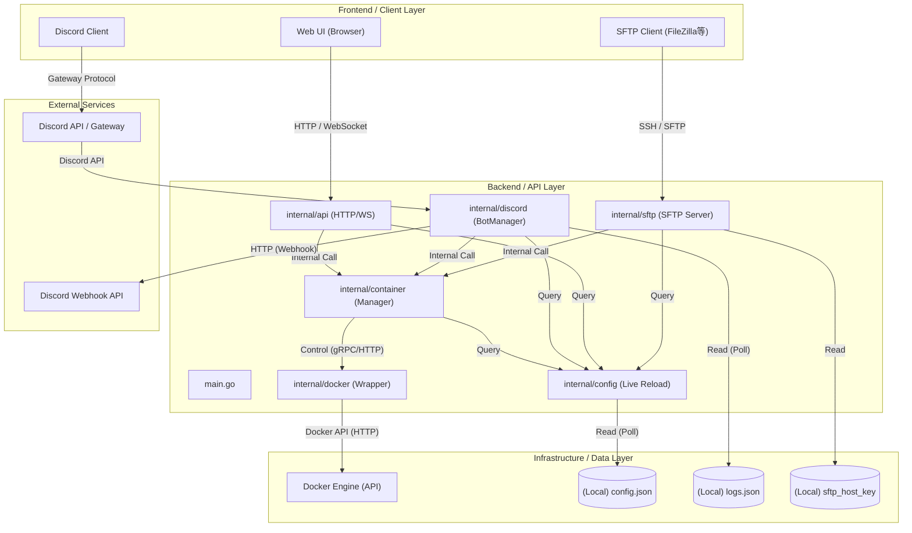

# システム設計書: play-bin

## 1. 技術スタック (Tech Stack)

### Languages & Frameworks

- **Go (1.25.5)**: バックエンドのコアロジック、並列処理、Docker制御、API、およびSFTPサーバーの実装に使用。
- **Discordgo**: Discord Bot APIのラッパー。
- **Gorilla WebSocket**: ターミナル操作およびステータス監視のための双方向通信。
- **pkg/sftp**: カスタム仮想ファイルシステムを介したコンテナ内ファイルへのアクセス。

### Infrastructure & Runtime

- **Docker**: コンテナ管理対象、およびDocker SDK for Goを通じた制御インターフェース。
- **Local Storage**: 永続化設定（`config.json`, `logs.json`）およびSFTPホストキーの保存。

### Development Tools

- **VSCode**: 主要な開発IDE。
- **Gemini / Antigravity**: AI支援によるコーディングおよびアーキテクチャ設計。

---

## 2. システム概要 (High-Level Overview)

本システムは、Dockerコンテナとして稼働するゲームサーバー等の一元管理を目的としたバックエンドプラットフォームです。
ユーザーはブラウザベースのWeb UI、Discordチャット、またはSFTPクライアントを通じて、コンテナの操作（起動・停止・コマンド送信）やファイル管理をシームレスに行うことができます。
ソフトウェア内部では、設定ファイルに基づきDocker APIを動的に呼び出し、リアルタイムなコンテナ制御とステータス監視を実現します。
また、特定のパターンに一致するコンテナログをDiscord Webhook経由で転送する機能を備え、管理者の効率的な運用を支援します。

---

## 3. アーキテクチャ図 (Architecture Diagram)

---

## 4. コンポーネント詳細

### Frontend / Client Layer

- **Web UI**: ブラウザからコンテナのステータス確認、電源操作、リアルタイムターミナル操作を提供。
- **Discord Client**: ユーザーがスラッシュコマンド（`/action`, `/cmd`）を通じてコンテナを制御するインターフェース。
- **SFTP Client**: コンテナ内の特定のボリュームへアクセスし、設定ファイルやデータのアップロード・ダウンロードを実行。

### Backend / API Layer

- **internal/api**: HTTP/WebSocketサーバー。認証とコンテナ操作、および統計情報の配信を担当。
- **internal/discord**: Discord連携の中核。スラッシュコマンドの受付と、リアルタイムなログ転送を管理。
- **internal/sftp**: 内蔵SFTPサーバー。ユーザー権限に基づき、コンテナのマウントパスを仮想ディレクトリとしてマッピング。
- **internal/container**: 高レベルなコンテナ操作（Start/Stop/Kill/Stats）をカプセル化し、Docker SDKの詳細を抽象化。
- **internal/config**: 設定ファイルの管理。実行時のホットリロードをサポートし、権限情報を一括管理。

### Infrastructure / Data Layer

- **Docker Engine**: アプリケーションの実体が稼働する基盤。
- **config.json**: データベースの役割を果たす中心的な設定ファイル（サーバー、ユーザー、Discord設定）。
- **logs.json**: ログ監視のルール定義。
- **sftp_host_key**: SFTPサーバーの識別に使用されるホストキー。

### External Services

- **Discord API**: Botの通信およびスラッシュコマンドの登録・実行に使用。
- **Discord Webhook**: 指定した条件にマッチしたコンテナログをDiscordチャンネルへ出力するために使用。
