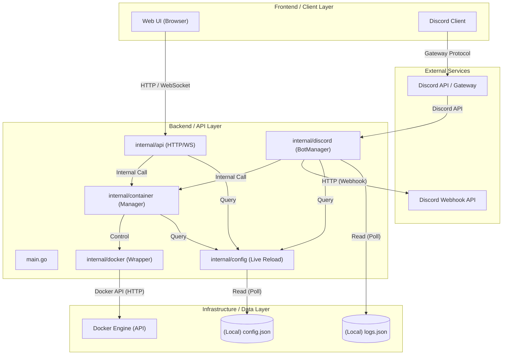

# システム設計書: play-bin

## 1. 技術スタック (Tech Stack)

### Languages & Frameworks

- **Go (1.25.5)**: バックエンドのコアロジック、並列処理、Docker制御、APIの実装に使用。
- **Discordgo**: Discord Bot APIのラッパー。
- **Gorilla WebSocket**: ターミナル操作およびステータス監視のための双方向通信。

### Infrastructure & Runtime

- **Docker**: コンテナ管理対象、およびDocker SDK for Goを通じた制御インターフェース。
- **WebDAV / Local Storage**: 各サーバー（コンテナ）のバックアップおよび設定ファイルの保存。

### Development Tools

- **VSCode**: 主要な開発IDE。
- **Gemini / Antigravity**: AI支援によるコーディングおよびアーキテクチャ設計。

---

## 2. システム概要 (High-Level Overview)

本システムは、Dockerコンテナとして稼働するゲームサーバー等の管理を一元化するバックエンドプラットフォームです。
ユーザーはWeb UI、またはDiscordのチャットインターフェースを通じて、コンテナの起動・停止・コマンド送信・ログ確認をリアルタイムに行うことができます。
本ソフトウェアは、設定ファイル（`config.json`）に基づき、Discord BotやWeb APIサーバーとして振る舞い、Docker APIを介してターゲットとなるコンテナを動的に制御します。
また、コンテナのログをDiscord Webhookへ転送する機をも備えており、管理者が常にサーバーの状態を監視できる環境を提供します。

---

## 3. アーキテクチャ図 (Architecture Diagram)

---

## 4. コンポーネント詳細

### Frontend / Client Layer

- **Web UI**: ブラウザからDockerコンテナのステータス確認、電源操作、Web終端でのコンソール操作を提供。
- **Discord Client**: ユーザーがスラッシュコマンド（`/action`, `/cmd`）を入力、または通常メッセージをコンテナへ送信するインターフェース。

### Backend / API Layer

- **internal/api**: HTTP/WebSocketサーバー。認証（トークンベース）とコンテナ操作エンドポイントを提供。
- **internal/discord**: Discord Botの常駐サービス（`BotManager`）。スラッシュコマンドの受付、メッセージ送信、およびコンテナログのリアルタイムWebhook転送を管理。
- **internal/container**: 高レベルなコンテナ操作（Start/Stop/Kill/Backup/Restore）をカプセル化。Docker SDKの複雑なオプションを隠蔽。
- **internal/config**: 設定ファイル（`config.json`）の管理。実行時のホットリロード（`Reload`）をサポート。
- **internal/docker**: Docker SDK for Goの低レベルな初期化（`Client`）と、共通処理を提供。

### Infrastructure / Data Layer

- **Docker Engine**: 実際にゲームサーバーなどが稼働している基盤。
- **config.json**: サーバー設定、ユーザー権限、Discord連携情報などを定義する中心的な設定。
- **logs.json**: ログ転送ルール（正規表現、転送先Webhook）を定義。

### External Services

- **Discord API**: Botの通信およびスラッシュコマンドの登録・実行に使用。
- **Discord Webhook**: 指定した条件にマッチしたコンテナログをDiscordチャンネルへ出力するために使用。
